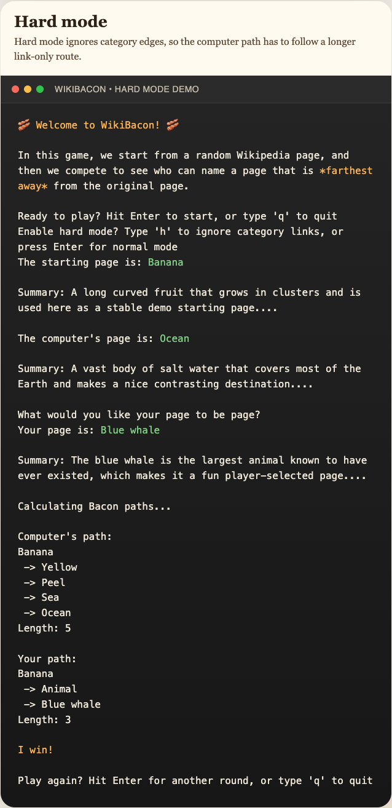

# Engineering Assessment Notes

This repository was updated to address the highest-value issues in the assessment first, then to complete the remaining high-ROI minor improvements.

## Summary

The work completed in this exercise focused on nine areas:

1. Fixing biased page selection and removing the accidental overuse of `Python (programming language)`.
2. Fixing pathfinding correctness issues so returned paths are valid and unreachable cases fail cleanly.
3. Improving meta-category filtering and expanding regression coverage.
4. Adding targeted type hints and type-hint regression coverage.
5. Eliminating the reproducible runtime warning noise in the local environment.
6. Improving cache reuse across both path searches in a round.
7. Reproducing and patching the third-party HTML parser warning path.
8. Adding an optional category-less hard mode.
9. Adding metadata-driven persistent cache cleanup and bounded cache growth.

## Screenshots

These deterministic demo captures show the CLI in both default mode and hard mode.
They were generated from stable mocked runs so the README does not depend on live Wikipedia responses or random page selection.

### Normal mode


### Hard mode



## Changelog

### 1. Random page selection and page lookup fixes

- Removed deterministic random seeding from `main.py` so page selection is no longer forced into the same sequence every run.
- Changed `wiki.get_page()` to return `None` when a page cannot be resolved instead of silently falling back to `Python (programming language)`.
- Added retry logic for random page selection in `main.py` so invalid dictionary words are skipped until a valid page is found.
- Added a regression test to verify the game does not call `random.seed()`.
- Added a regression test to verify random selection retries invalid pages instead of accepting bad results.

### 2. Pathfinding correctness and stability fixes

- Replaced the previous recursive pseudo-bidirectional path search with a bounded greedy best-first search in `wiki.py`.
- Removed invalid path-joining behavior that could fabricate paths through unordered intersections.
- Stopped relying on the incorrect assumption that links from the destination page could be treated as backlinks.
- Added bounded exploration controls with path-length and search-step limits.
- Added per-search in-memory caches for page objects, page links, and embeddings to avoid repeated work during a single search.
- Made cached link loading tolerate unresolved pages cleanly by returning an empty link set.
- Kept the heuristic design goal intact: the search still aims to find a valid path, not necessarily the shortest path.

### 3. Game-loop error handling improvements

- Added graceful handling for `find_short_path()` returning `None`.
- Added user-facing output for missing paths: `No path found.` with a score of `0` instead of crashing during path display.
- Added graceful handling for invalid user-entered destination pages.
- When a user page cannot be resolved, the game now informs the player and returns to the play-again prompt instead of dereferencing `None`.

### 4. Meta-category filtering improvements

- Expanded `is_regular_page()` to filter more administrative and metadata-style labels.
- Added filtering for patterns such as `wikidata`, `wikipedia`, `short description`, `template:`, `help:`, and `user:`.
- Preserved thematic categories like `Fruit` and `Blue Things` so game-relevant category traversal still works.
- Added integration-style tests to verify cached page links retain valid categories and exclude meta/admin links and self-links.

### 5. Test coverage improvements

- Added tests for failed page lookup behavior.
- Added tests for retrying invalid random page choices.
- Added a test to ensure the RNG is not reseeded by the app.
- Added tests for missing-path handling in the game loop.
- Added tests for invalid user-entered pages.
- Added path-validity tests to ensure returned paths only use real transitions in the mocked graph.
- Added unreachable-path and invalid-intersection regressions for pathfinding.
- Added helper and integration tests for the expanded filtering behavior.

### 6. Type-hinting improvements

- Added pragmatic standard-library type hints to the public functions in `main.py` and `wiki.py`.
- Added explicit helper annotations for the pathfinding and cache helpers in `wiki.py`.
- Introduced readable cache aliases for page, link, and embedding dictionaries in `wiki.py`.
- Kept the annotations aligned with the actual runtime contracts established by the tests, including unresolved pages and missing paths.

### 7. Type-hint regression coverage

- Added a dedicated `test/test_type_hints.py` module.
- Added regression tests that inspect type annotations with `typing.get_type_hints()`.
- Covered public function annotations in both `main.py` and `wiki.py`.
- Covered the key helper/cache function annotations in `wiki.py`.

### 8. Warning suppression

- Investigated the warning TODO by reproducing runtime fetches through both `wiki.get_page()` and the underlying `wikipedia` library.
- Determined that the reproducible warning in this environment included a local `urllib3` / `LibreSSL` warning and a third-party BeautifulSoup parser warning in the `wikipedia` package's disambiguation flow.
- Added a narrow, early warning filter in `wiki.py` so the local `urllib3` warning no longer pollutes test and runtime output.

### 9. HTML parser warning investigation and fix

- Added a standalone diagnostic at `test/diagnostic_html_parser_warning.py` to reproduce the `wikipedia` package's disambiguation parsing path without depending on live Wikipedia responses.
- Confirmed the parser warning source was `BeautifulSoup(html)` inside `wikipedia.wikipedia`, where no explicit parser was provided.
- Patched the app locally by overriding the `wikipedia.wikipedia` module's `BeautifulSoup` symbol so it defaults to `features="html.parser"`.
- Verified that the diagnostic script still reaches the disambiguation path and raises the expected `DisambiguationError`, but no longer emits `GuessedAtParserWarning`.

### 10. Caching improvements

- Expanded the public cache API in `wiki.py` so `get_page_links_with_cache()` can reuse caller-supplied page and link caches.
- Expanded `find_short_path()` so callers can optionally supply page, link, and embedding caches.
- Updated `main.py` to create round-scoped caches once and reuse them across both the computer search and the user search.
- Added a SQLite index on `pages.name` to improve persistent cache lookups.
- Kept the change intentionally small by improving cache lifetime and reuse rather than redesigning the persistence layer.

### 11. Additional cache regression coverage

- Added tests that verify caller-supplied caches are honored by `get_page_links_with_cache()`.
- Added tests that verify repeated searches can reuse supplied caches without changing path correctness.
- Updated the type-hint regression coverage so the cache-aware public signatures remain locked in.

### 12. Category-less hard mode

- Added an opt-in hard mode that ignores category links during pathfinding while preserving the existing default mode.
- Refactored cached page-edge storage so links and categories can be distinguished instead of always being merged together.
- Extended `get_page_links_with_cache()` and `find_short_path()` with an `ignore_categories` flag.
- Updated `main.py` to prompt once at startup for hard mode and to apply the same rule set to both the computer and player searches.
- Kept default behavior unchanged when hard mode is not enabled.

### 13. Hard mode regression coverage

- Added tests showing that normal mode still uses category shortcuts where appropriate.
- Added tests showing that hard mode removes category shortcuts and falls back to link-only traversal.
- Added a main-loop test to verify the hard-mode selection is passed through to both pathfinding calls.
- Updated the type-hint regression coverage to include the new hard-mode-aware function signatures.

### 14. README screenshots

- Added deterministic CLI screenshots for both normal mode and hard mode.
- Added a small HTML gallery source used to render terminal-styled screenshot assets for the README.
- Stored the mocked demo transcripts alongside the screenshot assets so the documentation artifacts are reproducible.

### 15. Cache cleanup and lifecycle management

- Extended the SQLite cache in `wiki.py` so page rows now track freshness and recency metadata with `updated_at` and `last_accessed_at`.
- Defined explicit default cache policy values in `wiki.py`: a 7-day TTL for persistent rows, a 1000-row persistent cache cap, cleanup every 25 cache writes, a 256-entry link-cache cap, and a 512-entry embedding-cache cap.
- Added backward-compatible schema bootstrap logic so existing `pages.db` files are upgraded in place instead of requiring a manual reset.
- Added stale-cache refresh behavior that re-fetches expired rows when possible and safely falls back to cached data if a live refresh fails.
- Added opportunistic persistent-cache pruning so expired rows are deleted and oversized caches are trimmed by least-recently-used access time.
- Added bounded trimming for the in-memory link and embedding caches so long-running searches cannot grow those dictionaries without limit.
- Added deterministic regression coverage for schema migration, stale-row refresh, stale-row fallback, persistent pruning, and bounded in-memory cache behavior.

## Files Updated

- `main.py`
- `wiki.py`
- `test/test_type_hints.py`
- `test/diagnostic_html_parser_warning.py`
- `test/test_main.py`
- `test/test_wiki.py`
- `assets/screenshots/normal_demo.txt`
- `assets/screenshots/hard_mode_demo.txt`
- `assets/screenshots/readme_gallery.html`
- `assets/screenshots/wikibacon-normal-mode.png`
- `assets/screenshots/wikibacon-hard-mode.png`
- `README.md`

## Validation

The final validation run used:

```bash
python3 -m pytest
```

Latest result:

- `30 passed`
- `0 warnings`

The latest suite run completed cleanly with no warnings.

## Remaining Work

Optional follow-up work could include:

- additional tuning of the default cache policy values, currently a 7-day TTL, 1000 persistent rows, cleanup every 25 writes, 256 link-cache entries, and 512 embedding-cache entries, based on real-world usage
- batching or throttling `last_accessed_at` writes further if cache read volume becomes high enough to justify it